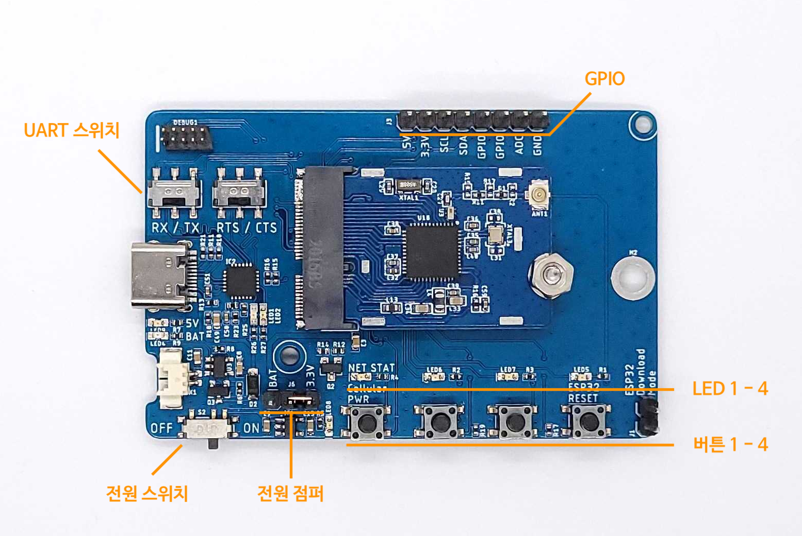

# NRF52832 Ping pong example

-------------------------

 

NRF52832 와 Android Application 간의 통신 예제입니다.
 

BLE 통신을 사용합니다.
 

Android, iOS, Aggregator 와 통신이 가능합니다.
 

네이버 스마트 스토어에서 구매 가능합니다.
 

[네이버 스마트 스토어](https://smartstore.naver.com/axden)
 

-------------------------

### NRF52832 SDK Download
 

 
 

Download [Nordic NRF52832 SDK](https://www.nordicsemi.com/Products/nRF52832/Download#infotabs)

-------------------------

### Note
 

Works with SoftDevice S132 v7.2.0, provided with SDK 17.1.0.
 

To compile it, clone the repository in the [SDK]/examples/ble_peripheral folder.

-------------------------

### Project import
 

 

File / New / Others / Make Project with Existing Code
 

 

File / New / Others / Make Project with Existing Code

-------------------------

### Eclipse setting
 

 

Properties / C/C++ General / Preprocessor Include Path, Macros etc. / Providers / CDT GCC Build output Parser
 

` (.*gcc)|(.*[gc]\+\+) `
 

 

Properties / C/C++ Build
 

` make VERBOSE=1 `
 
